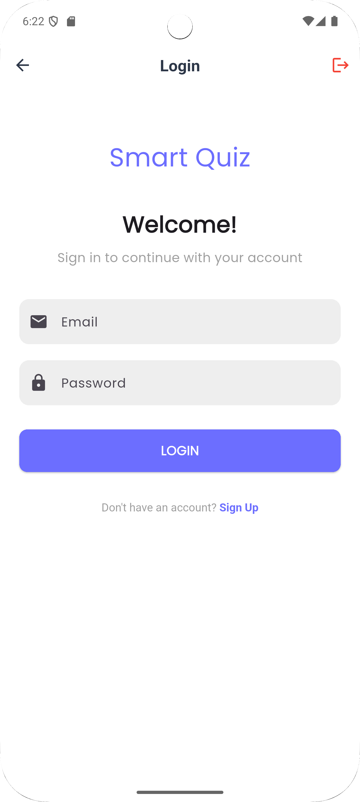
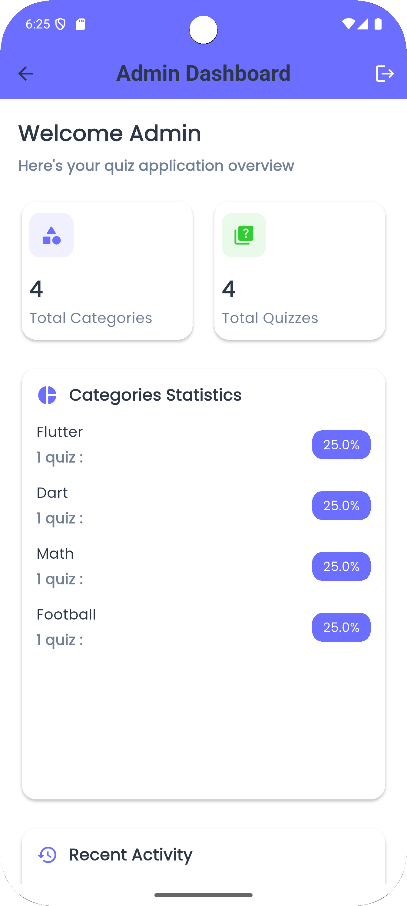
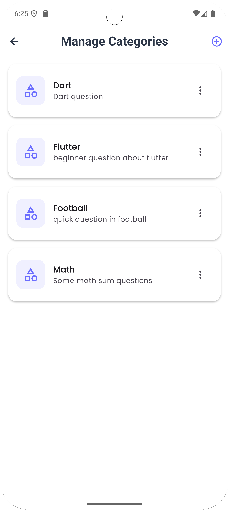

# 🎯 Smart Quiz App

📱 A Flutter-based quiz application that allows users to test their knowledge across various categories. The app features a clean, user-friendly interface with role-based access control for both learners and administrators.

## ✨ Features

<div align="center">

| Feature | Description |
|---------|-------------|
| 🔐 **User Authentication** | Secure login and signup with email/password |
| 👥 **Role-Based Access** | Separate interfaces for learners and administrators |
| 📚 **Category Browsing** | Browse quizzes by different categories |
| 🔍 **Smart Search** | Easily find specific quiz categories |
| 📱 **Responsive Design** | Works on all devices and screen sizes |
| 🎨 **Modern UI** | Beautiful interface with smooth animations |

</div>

## 🖼️ Screenshots

| Login Screen | Home Screen | Category View |
|--------------|-------------|----------------|
|  |  |  |

## 🚀 Getting Started

### 📋 Prerequisites

- Flutter SDK (latest stable version)
- Dart SDK (latest stable version)
- Firebase account (for authentication and database)
- Android Studio / Xcode (for building the app)

### ⚙️ Installation

1. **Clone the repository**
   ```bash
   git clone https://github.com/yourusername/quiz_app.git
   cd quiz_app
   ```

2. **Install dependencies**
   ```bash
   flutter pub get
   ```

3. **Firebase Setup**
   - Create a new project at [Firebase Console](https://console.firebase.google.com/)
   - Add your Android/iOS apps
   - Download config files:
     - Android: `google-services.json` → `android/app/`
     - iOS: `GoogleService-Info.plist` → `ios/Runner/`

4. **Run the app**
   ```bash
   flutter run
   ```

## 🏗️ Project Structure

```
lib/
├── 📄 main.dart                # App entry point
├── 📁 model/                  # Data models
│   ├── 📄 category.dart       # Category model
│   ├── 📄 question.dart       # Question model
│   └── 📄 quiz.dart           # Quiz model
├── 📁 services/               # Business logic
│   └── 📄 auth_service.dart   # Authentication
├── 📁 theme/                  # Theming
│   └── 📄 theme.dart          # Theme config
└── 📁 view/                   # UI components
    ├── 📁 auth/               # Auth screens
    │   ├── 📄 login_screen.dart
    │   └── 📄 signup_screen.dart
    └── 📁 user/               # User screens
        ├── 📄 home_screen.dart
        └── 📄 category_screen.dart
```

## 📦 Dependencies

| Package | Version | Usage |
|---------|---------|-------|
| `firebase_core` | ^2.15.1 | Firebase Core |
| `firebase_auth` | ^4.9.0 | Authentication |
| `cloud_firestore` | ^4.9.1 | Database |
| `provider` | ^6.0.5 | State Management |
| `flutter_animate` | ^4.2.0 | Animations |

## 🤝 Contributing

Contributions are welcome! Please feel free to submit a Pull Request.

1. Fork the Project
2. Create your Feature Branch (`git checkout -b feature/AmazingFeature`)
3. Commit your Changes (`git commit -m 'Add some AmazingFeature'`)
4. Push to the Branch (`git push origin feature/AmazingFeature`)
5. Open a Pull Request

## 📄 License

Distributed under the MIT License. See `LICENSE` for more information.

## 🙏 Acknowledgments

- Flutter Team for the amazing framework
- Firebase for the backend services
- All open-source contributors

---

<div align="center">
  Made with ❤️ by Your Name
</div>
